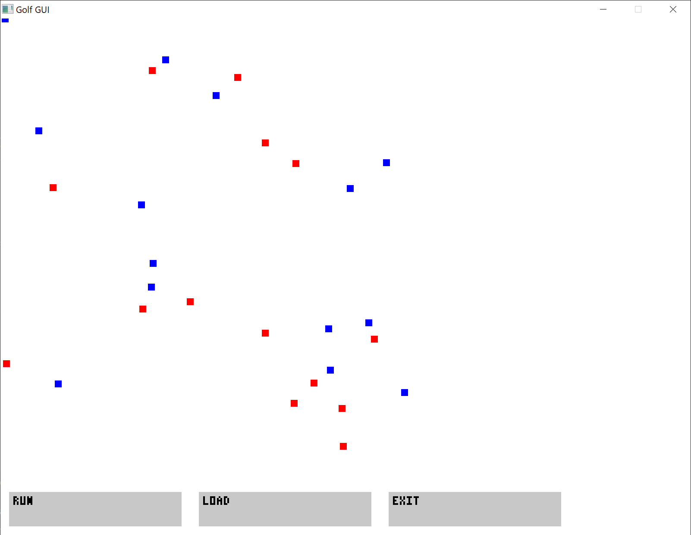
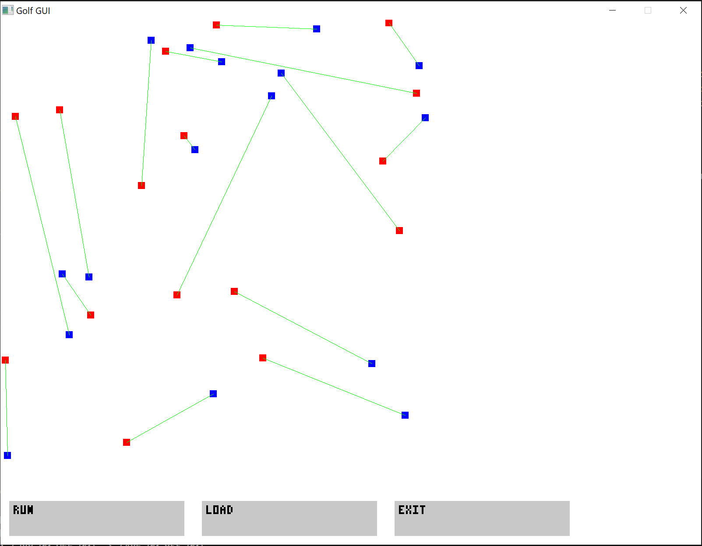

## Gra w Golfa

Kompletna aplikacja do:
- generowania instancji problemu punktów „piłek” i „dołków”,
- wizualizacji i rozwiązania dopasowania w GUI (SDL3),
- zapisu wyników,
- pomiaru czasu działania algorytmu i analizy złożoności.

### Treść

"Na polu golfowym znajduje się $n$ piłeczek oraz $n$ dołków na piłeczki. Golfiści chcą jednocześnie każdy swoją piłeczkę umieścić w którymś z dołków. W tym celu ustalają między sobą, który celuje do którego dołka, ale w taki sposób, by tory ich piłeczek się nie przecinały, co gwarantuje brak zderzeń piłeczek. Załóżmy, że piłeczki i dołki są punktami na płaszczyźnie oraz że żadne trzy z tych punktów nie są współliniowe, a tory piłeczek są odcinkami prostej. Przedstaw działający w czasie $O(n^2\log n)$ algorytm przydzielania piłeczek do dołków, tak aby żadne dwa tory piłeczek się nie przecinały."

### Jak uruchomić

By uruchomić grę należy odpalić plik wykonayalne **main.exe** bez żadnych argumentów, po czym aplikacja każe nam wybrać plik tekstowy z danymi, które chcielibyśmy wczytać.
Zostało to zobrazowane na poniższej grafice:
.

Mamy następnie 3 opcje, dostepne na osobnych przyciskach:
    - Exit  - Wyjście z gry/Zamknięcie aplikacji
    - Load  - Wczytanie pliku tekstowego z punktami
    - Run   - Uruchomienie algorytmu, wizualizacja rozwiązania oraz automatyczne zapisanie rozwiązania do katalogu Outputs.

Aplikacja po prezentacji wyników prezentuje się następująco:
.

### Zmiany i kompilacja
Jeżeli dokonano zmian w kodzie, ponownej kompilacji można szybko dokonać poprzez Makefile wpisując komendę `make` w głównym folderze projektu.  
Wszystkie nasze pliki wykonywalne powinny uledz rekomplikacji po ewentualnych zmianach.  

### Generowanie instancji problemu/gry
Plik wykonywalny **file_generator.exe** generuje 25 plików z instancjami problemu, każdy do pliku .txt o formacie `input_{i}.txt`, gdzie
i jest numerem instancji i musi występować w nazwie pliku.  
Plik uruchamiamy poprzez wywołanie pliku wykonywalnego .exe `file_generator.exe`.  
Użytkownik może wywołać skrypt z agrumentem `<n>` , np. `./file_generator.exe 100`, wtedy wygenerowany zostanie tylko jeden plik do katalogu `Input_Data/` z instancją problemu dla ilości dołków i piłek o wartości `<n>`.  
**Uwaga.** Plik zostanie zapisany pod nazwą `input_n_<n>_<id>.txt`, gdzie id będzie unikalną i losową wartością dla pliku (później będzie można dopasować do pliku z katalogu Outputs, gdzie potencjalnie zostanie zapisany plik wynikowy).

### Benchmarking
Istnieje możliwość dokonywania benchmarkingu danego problemu poprzez plik **benchmark.exe**.  
Dokonujemy tego przez wywołanie `benchmark.exe {times_rep} {n} {output_file.txt}` gdzie:  
    - n: do jakiej wielkości eksperymentu wykonywać go (od wielkości 1 do n),
    - times_rep: ile wykonywać powtórzeń dla jednej instancji eksperymentu, 
    - output_file.txt: plik do, którego zapisujemy dane wyjściowe, czyli średnia i ochylenie standardowe w sekundach dla czasu wykonywania się jednego eksperymentu.
